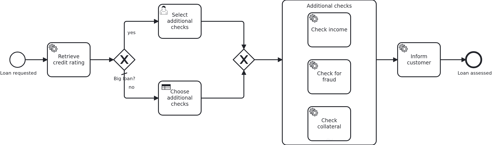

# Ad-hoc subprocesses

[](./LICENSE)

Every other BPMN blueprint shows a model which prescribes the order and an application which
answers. An ad-hoc subprocess turns that around. It holds activities without sequence flows
between them, and which of them run is decided while the workflow already stands in front of
them, by something outside the model. This blueprint shows both halves: the activities, which
are ordinary tasks with ordinary methods behind them, and the two ways the choice arrives.

## What this blueprint shows



The loan approval of the base blueprint, with additional checks after the scoring. Three
checks are drawn side by side inside the ad-hoc subprocess, and a request runs the ones
somebody picked:

- A big loan goes to a case worker. The user task reports its id, the application keeps it,
  and answering through the API writes the picked element ids onto the workflow aggregate.
  VanillaBP shares the aggregate with the BPMS while completing the task, so the list is
  there when the workflow enters the subprocess.
- Everything else is decided by a decision table. The cluster evaluates the DMN deployed
  next to the BPMN file and writes its result into the same variable. Not a line of Java is
  involved on that path, and that is the point of having both in one blueprint: the element
  does not know who picked.

What the model reads is one attribute, `activeElementsCollection`, a FEEL expression naming
the ids of the elements to activate. It is evaluated once, when the workflow enters the
element. There is no completion condition, so the workflow leaves the subprocess when
everything it activated is done, and the service task behind it runs.

Two things are worth knowing before copying this.

The BPMN element ids are a contract. The list names elements, not tasks, so the ids of the
three activities appear in the code and in the decision table. `Check.java` is the one place
they are written down on the Java side, and `loan_approval.dmn` is the one place on the
model side.

The checks run at the same time, so two branches write the same workflow aggregate. The
aggregate therefore carries a version attribute: the collision becomes an optimistic locking
exception the BPMS retries, instead of a write which disappears without an error. What the
other ways of dealing with two writers are, and when each of them fits, is shown by
[`persistence-parallel-branches`](https://github.com/vanillabp-blueprints/persistence-parallel-branches-quarkus).

You will see that at work. When both checks reach the aggregate at the same time one of them
loses, VanillaBP logs an ERROR naming the task and the workflow, and the BPMS retries it a
moment later. Nothing is lost, and the retry is what the version attribute buys: without it the
second write would have overwritten the first and nothing would have been logged at all. The
Camunda 8 profile shortens the retry backoff so that moment stays short.

A third decision maker exists and is not shown here: Camunda's
[AI agent](https://docs.camunda.io/docs/components/agentic-orchestration/ai-agent-subprocess/)
is a connector on exactly this element, and the activities inside are the tools it may choose
from. It needs a connector runtime and an account with a model provider, which is why this
blueprint stays with the two decision makers anybody can run.

This blueprint runs on Camunda 8 only. Camunda 7 does not execute the element: its parser
lists it among the activity types it ignores and only warns while deploying, so a Camunda 7
build would ask for handlers of activities which never run.

## Delta to the base blueprint

Compared to [`module-single`](https://github.com/vanillabp-blueprints/module-single-quarkus):

|            File            |                                                            What is different                                                            |
|----------------------------|-----------------------------------------------------------------------------------------------------------------------------------------|
| `loan_approval.bpmn`       | an ad-hoc subprocess holding three service tasks, a user task and a business rule task ahead of it, and a gateway choosing between them |
| `loan_approval.dmn`        | the decision table picking the checks for a request nobody has to look at                                                               |
| `model/Check.java`         | the three checks and the BPMN element id of each of them                                                                                |
| `model/Aggregate.java`     | `checksToRun`, the list the model reads, a version attribute, and one flag per check                                                    |
| `WorkflowTaskHandler.java` | one `@WorkflowTask` method per check, and none for the subprocess itself                                                                |
| `Service.java`             | the checks as business methods, and the two halves of the user task picking them                                                        |
| `Workflow.java`            | `completeUserTask` in addition to `startWorkflow`, and nothing about the subprocess                                                     |
| `ApiController.java`       | the URL picking the checks, carrying the task id and the names of the checks                                                            |
| `LoanApprovalIT.java`      | one test per decision maker: the case worker picks two of three, the decision table picks two of three                                  |
| `pom.xml`                  | one BPMS profile instead of two                                                                                                         |

## Running it

Requires a JDK 21 and a Camunda 8 cluster, because Camunda 8 is a remote engine:

```bash
mvn install verify
```

The cluster's address, and everything else specific to that engine, lives in
`application/src/main/resources/application-camunda8.yaml`, with a copy for the module's own
test:

```yaml
vanillabp:
  adapters:
    camunda8:
      # Camunda 8 is a remote engine: point this at your cluster.
      rest-address: http://localhost:8080
```

That file is loaded because the Maven profile `camunda8` makes the config profile of the same
name the parent of whichever profile the application runs in. It is the only profile of this
blueprint and it is active by default, so the build, the tests and `quarkus:dev` all follow it
without anybody naming an engine.

Start the application:

```bash
mvn -pl application quarkus:dev
```

Nothing about identifiers shows up at startup: the BPMS profile sets
`name-clash-avoidance: use-prefix`, so VanillaBP puts the workflow module ID in front of every
identifier before it reaches the engine and takes it off again on the way back. What the modes
are and what each of them costs is in
[the wiki](https://github.com/vanillabp/adapter-platform-integration/wiki/Workflow-modules#how-name-clashes-are-avoided).
The ids of the activities inside the subprocess are untouched by any of it, which is why the
list on the aggregate and the decision table can name them.

Start a loan approval nobody has to look at. This is the only URL you need:

```
http://localhost:8080/api/loan-approval/start?amount=5000
```

The decision table picks, the two checks it picked run, and the process ends:

```
Loan approval '0f7c…' started
Credit rating of loan approval '0f7c…' is 50
Income of loan approval '0f7c…' was checked
Loan approval '0f7c…' was checked for fraud
The customer of loan approval '0f7c…' was informed
```

Ask for more than ten thousand and a case worker has to pick instead:

```
http://localhost:8080/api/loan-approval/start?amount=20000
```

The process stops at the user task and logs one URL per combination somebody can pick, each
one filled in and ready to be clicked:

```
Loan approval '3b1e…' waits for somebody to pick the additional checks. Continue with one of:
  income                    -> http://localhost:8080/api/loan-approval/3b1e…/select-checks/1a2b…?checks=income
  fraud                     -> http://localhost:8080/api/loan-approval/3b1e…/select-checks/1a2b…?checks=fraud
  collateral                -> http://localhost:8080/api/loan-approval/3b1e…/select-checks/1a2b…?checks=collateral
  income,fraud              -> http://localhost:8080/api/loan-approval/3b1e…/select-checks/1a2b…?checks=income,fraud
  income,collateral         -> http://localhost:8080/api/loan-approval/3b1e…/select-checks/1a2b…?checks=income,collateral
  fraud,collateral          -> http://localhost:8080/api/loan-approval/3b1e…/select-checks/1a2b…?checks=fraud,collateral
  income,fraud,collateral   -> http://localhost:8080/api/loan-approval/3b1e…/select-checks/1a2b…?checks=income,fraud,collateral
```

Opening one of them completes the user task, the picked checks run, and the ones nobody picked
stay untouched although they are drawn in the model. Opening the same URL twice answers with
the message that this selection is not open any more, which the application decides on its
own, without asking the BPMS.

## How it works

|                                          File                                          |                                            Role                                            |
|----------------------------------------------------------------------------------------|--------------------------------------------------------------------------------------------|
| `loan-approval/src/main/resources/loan-approval/processes/camunda8/loan_approval.bpmn` | the ad-hoc subprocess, its `activeElementsCollection`, and the two ways the list is filled |
| `loan-approval/src/main/resources/loan-approval/processes/camunda8/loan_approval.dmn`  | the decision table, whose output column holds BPMN element ids                             |
| `.../loanapproval/model/Check.java`                                                    | the checks and their element ids, the contract between code and model                      |
| `.../loanapproval/model/Aggregate.java`                                                | `checksToRun`, the version attribute, and what each check wrote                            |
| `.../loanapproval/WorkflowTaskHandler.java`                                            | one `@WorkflowTask` method per check, and no method for the element itself                 |
| `.../loanapproval/Service.java`                                                        | the checks as business methods, and keeping the task id while somebody picks               |
| `.../loanapproval/Workflow.java`                                                       | `completeUserTask`, the only place `ProcessService` is used                                |
| `.../loanapproval/ApiController.java`                                                  | the GET endpoint carrying the task id and the names of the checks                          |
| `loan-approval/src/test/.../LoanApprovalIT.java`                                       | one test per decision maker, waiting for the aggregate rather than asking the engine       |

The order of events on the path a person decides: the service task fills in the credit rating,
the gateway sends a big loan to the user task, and VanillaBP calls
`WorkflowTaskHandler#selectChecks` with `TaskEvent.CREATED`. That method does not do the work,
it keeps the task's `@TaskId` on the aggregate. When the answer arrives through the API,
`Service#selectChecks` writes the picked element ids onto the aggregate and tells `Workflow`
that the checks were selected. `Workflow#checksSelected` completes the user task in a
transaction, so the aggregate is saved along with the answer and the list reaches the BPMS with
it.

On the other path nothing of this happens. The gateway sends the request to the business rule
task, the cluster evaluates the decision and writes its result into the process variable the
subprocess reads, and the workflow enters the element without the application having been
asked. So the aggregate's own `checksToRun` stays empty there, and what ran is visible in the
flags the checks wrote.

Either way the subprocess activates the elements the list names, each of them an ordinary job
served by an ordinary `@WorkflowTask` method. Two of them run at once, which is why the
aggregate carries a version attribute. When they are done the element is left, the service task
behind it informs the customer, and the process ends.

The tests wait rather than assert immediately. A BPMS runs tasks in transactions of its own,
and a remote engine gets to a task a moment after the workflow was started. Asserting right
away would be a test of timing rather than of the application.

## Documentation

- [Workflow aggregates](https://github.com/vanillabp/adapter-platform-integration/wiki/Workflow-aggregates): what is shared with the BPMS, which is how the list reaches the model
- [Two writers on one aggregate](https://github.com/vanillabp/adapter-platform-integration/wiki/Workflow-aggregates#two-writers-on-one-aggregate): why the aggregate carries a version attribute
- [User tasks](https://github.com/vanillabp/adapter-platform-integration/wiki/Workflow-tasks#user-tasks): the notification handler, the task id and completing the task later
- [Workflow tasks](https://github.com/vanillabp/adapter-platform-integration/wiki/Workflow-tasks): what a `@WorkflowTask` method is, which is all the activities inside the element need
- the wiki of the [BPMS adapter](https://github.com/vanillabp/adapter-platform-integration/wiki/BPMS-adapters) you use: which attribute of the model names the activities to run, and which flavours of the element it serves

This blueprint is developed in the monorepo
[`blueprints`](https://github.com/vanillabp-blueprints/blueprints). This repository is a
read-only mirror, **issues and pull requests belong there.**

## Noteworthy & Contributors

[VanillaBP](https://www.github.com/vanillabp/spi-for-java) was developed by [Phactum](https://www.phactum.at) with the
intention of giving back to the community as it has benefited the community in the past.


## License

Copyright 2026 Phactum Softwareentwicklung GmbH

Licensed under the Apache License, Version 2.0
